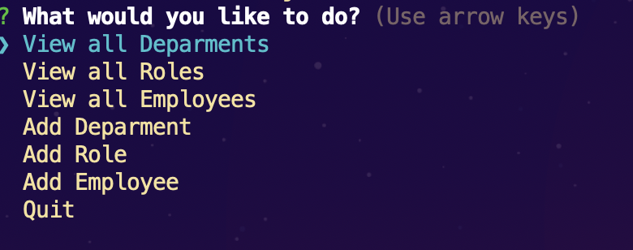
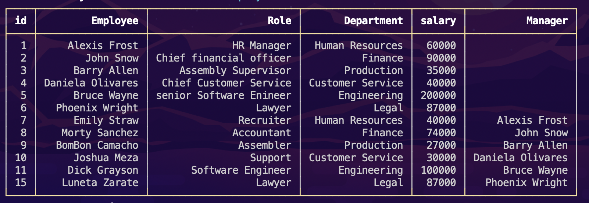

# Employee-index

A command-line application to manage a company's employee database, using Node.js, Inquirer, Express, and MySQL.

--- 

[Github](https://github.com/705h-S?tab=repositories)

[Walkthrough-video](https://drive.google.com/file/d/1kjfavFy3QuryDU14pSGHTCaDI0GcTWNh/view)


---

## Technologies Use
* [Node](https://nodejs.org/)
* [MySQL](https://dev.mysql.com)
* [MySQL2](https://www.npmjs.com/package/mysql2)
* [Inquirer](https://www.npmjs.com/package/inquirer)
* [Express](https://www.npmjs.com/package/express)
* [console-table-printer](https://www.npmjs.com/package/console-table-printer)

---

## Description
A command-line application to manage a company's employee database, using Node.js, Inquirer, and MySQL.

--- 

## installtion

After forking the repo on your terminal do a `npm i` to install all necessary packages.
Then run ` node index.js ` to start the program.

---

## Usage

By using inquirer a menu will be displayed and user can toggle between options.



Tables are displayed in a nice clean format thanks to the package called [console-table-printer](https://www.npmjs.com/package/console-table-printer).



In order to avoid spelling mistakes when typing names of departments, roles and managers. I've created arrays that contain the tables values. User can simply then select the input without having to worry about spelling mistakes. 
> inserting the array in Inquirer
``` javascript
{
            type: "list",
            name: "emDep",
            message: "What department does this Employee belong too?",
            choices: deps
}
```

> What the array contains. The first element is empty.
``` javascript
var deps = [
" ",    
"Human Resources",
"Finance",
"Legal",
"Production",
"Customer Service",
"Engineering"
];
```
> With the selection of the user input I did a `.indexOf` to get value as a number. I then insert the indexOf in the sql query. Since sql beings with index of 1 and not 0 to avoid an ofset of counting that's why the first element is empty so user would be discourage to select it. When user decides to add a department or role it'll get pushed to the array.

``` javascript
.then(answers => {
            rolls.push(`${answers.addRoleN}`);
            var depid = deps.indexOf(`${answers.roleDep}`);
            db.query(
                `INSERT INTO roles (title, salary, department_id)
                VALUES ("${answers.addRoleN}", "${answers.addRoleS}","${depid}" )`, function (err, res){
                    if(err){
                        console.log(err)
                    };
                    console.log(`Added ${answers.addRoleN} to the list!`);
                    Vroles();
                });
        });   
```
> The accuracy of it being correct depends on how the seeds.sql value was written. 

``` sql
INSERT INTO roles (title, salary, department_id)
VALUES -- 1
       ("HR Manager",60000, 1),
    --    2
       ("Chief financial officer", 90000, 2),
    --    3
       ("Assembly Supervisor", 35000, 4),
    --    4
       ("Chief Customer Service", 40000, 5),
    --    5
       ("senior Software Enineer",200000, 6),
    --    6
       ("Lawyer",87000.00, 3),
    --    7
       ("Recruiter",40000.00, 1),
    -- 8
       ("Accountant",74000.00, 2),
    -- 9
       ("Assembler",27000.00, 4),
    -- 10
       ("Support",30000.00, 5),
    -- 11
       ("Software Engineer",100000.00, 6);

```

--- 
## Contributor:

[Joshua Meza](https://705h-s.github.io/portfolio-charlie/)